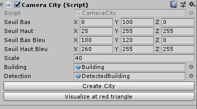
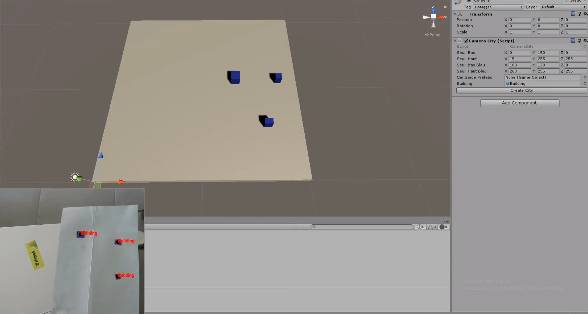

# Recognition City
<em>Recognition of blue rectangle on a white paper that simulate buildings and red triangle which give a POV for the camera in Unity </em> 
**Corentin GAUTIER**

## Implemented features :
- Images processing (expansion, convert gray image)
- Recognition of blue rectangle and red triangle 
- Smooth movment of the camera in Unity 

## Illustrations : 

**Exemple of use case : [Video](https://www.youtube.com/watch?v=AbVM-ZPWpCQ)**
## Use of the Project :
### On windows
- Import the Project on your PC
- Launching with Unity 2019.2.19
- Open Datagora scene
- Setup your HSV value to recognize your building's color
- You can modify the layout of your buildings, this will update in unity
- Launch "Create City" to visualize the city in unity
- Set the red triangle next to a building
- Launch "Visualize at red triangle". Then you got a smooth movement around the building selected

### On Linux
- Install library [OpenCV](https://docs.opencv.org/master/d7/d9f/tutorial_linux_install.html) 
 To use on Visual studio code :
    - Create a project folder
    - Ctrl + Shift + P to open command and search "C/C++ : Edit Configurations JSON"
    - Add in the JSON file an including path of the OpenCV library, it should be in "usr/local/include/opencv4/**"
    - Write your code and compile it with "clang++ -std=c++11 nameOfyourFile.cpp -o w `pkg-config --cflags --libs opencv` "
